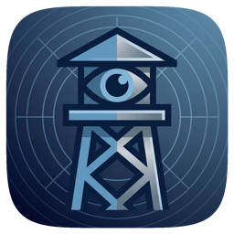

<div align="center">

# :shield: Sentry



**A native macOS menu bar app that monitors all outbound network connections in real time.**

[](https://swift.org)
[](https://developer.apple.com/xcode/swiftui/)
[](https://www.apple.com/macos/)
[](LICENSE)

[Features](#features) · [Getting Started](#getting-started) · [Tech Stack](#tech-stack)

</div>

---

## Features

- **Live Connection Scanner** — Polls `lsof` every 3 seconds to discover all active TCP/UDP connections, grouped by app
- **App Icon Resolution** — Automatically resolves process icons from running applications via PID lookup
- **GeoIP Country Lookup** — Pure Swift MMDB parser maps remote IPs to country codes with flag emoji
- **Reverse DNS Resolution** — Async hostname lookups with TTL-based LRU cache (1,000 entries, 5-minute TTL)
- **Connection History** — SQLite-backed persistent history with full-text search, app/country filters, and CSV export
- **Tracker Detection** — Suffix-matched blocklist of 100+ known tracker domains flags suspicious connections
- **Trust System** — First-seen detection with per-connection and per-app trust levels stored in SQLite + UserDefaults
- **Native Notifications** — Alerts on new, never-before-seen connections via `UNUserNotificationCenter`
- **Menu Bar Only** — Lives entirely in the menu bar with no Dock icon; full SwiftUI popover with tabbed Live/History views
- **Zero Dependencies** — No SPM packages; SQLite via system C API, GeoIP via pure Swift, DNS via POSIX `getnameinfo`

## Getting Started

### Prerequisites

- macOS 14.0 (Sonoma) or later
- Xcode 15+ or Swift 5.9+ toolchain
- (Optional) [GeoLite2-Country.mmdb](https://dev.maxmind.com/geoip/geolite2-free-geolocation-data) for country lookups

### Installation

```bash
git clone https://github.com/markksantos/Sentry.git
cd Sentry
swift build
swift run SentryApp
```

### Permissions

Sentry uses `lsof` to read network connections. On first run, macOS may prompt for permissions:

- **Full Disk Access** is _not_ required — `lsof` reads from `/dev` which is accessible by default
- **Notifications** — grant when prompted to receive alerts on new connections
- Drop a real `GeoLite2-Country.mmdb` into `Sources/SentryEngine/Resources/` to enable country flags

## Tech Stack

| Component | Technology |
|---|---|
| Language | Swift 5.9 |
| UI Framework | SwiftUI (MenuBarExtra, `.window` style) |
| Concurrency | Swift Actors, AsyncStream, structured concurrency |
| Database | SQLite3 C API (`import SQLite3`) |
| GeoIP | Pure Swift MMDB binary parser |
| DNS | POSIX `getnameinfo` (IPv4 + IPv6) |
| Notifications | UserNotifications framework |
| Network Scanning | `lsof -i -n -P +c0 -F pcnPtTf` (machine-readable output) |
| Architecture | 3-module SPM: SentryApp / SentryEngine / SentryUI |

## Project Structure

```
Sentry/
├── Package.swift
├── Sources/
│   ├── SentryApp/
│   │   ├── AppDelegate.swift
│   │   └── SentryApp.swift
│   ├── SentryEngine/
│   │   ├── DNS/
│   │   │   └── ReverseDNSResolver.swift
│   │   ├── GeoIP/
│   │   │   ├── GeoIPLookup.swift
│   │   │   └── MMDBReader.swift
│   │   ├── Models/
│   │   │   └── ConnectionEntry.swift
│   │   ├── Resources/
│   │   │   ├── GeoLite2-Country.mmdb
│   │   │   └── tracker-domains.txt
│   │   ├── Scanner/
│   │   │   ├── LSOFParser.swift
│   │   │   └── NetworkScanner.swift
│   │   ├── Storage/
│   │   │   └── SQLiteStore.swift
│   │   └── Trust/
│   │       ├── BlocklistMatcher.swift
│   │       └── TrustManager.swift
│   └── SentryUI/
│       ├── AppDetailView.swift
│       ├── AppListView.swift
│       ├── ConnectionRowView.swift
│       ├── HistoryView.swift
│       ├── MenuBarView.swift
│       ├── SettingsView.swift
│       └── ViewModels/
│           ├── DashboardViewModel.swift
│           └── HistoryViewModel.swift
└── Tests/
    └── SentryEngineTests/
        ├── Fixtures/
        │   └── lsof-sample-output.txt
        └── LSOFParserTests.swift
```

## License

MIT License © 2026 Mark Santos

---

<div align="center">

Built with :heart: by [NoSleepLab](https://nosleeplab.com)

</div>
